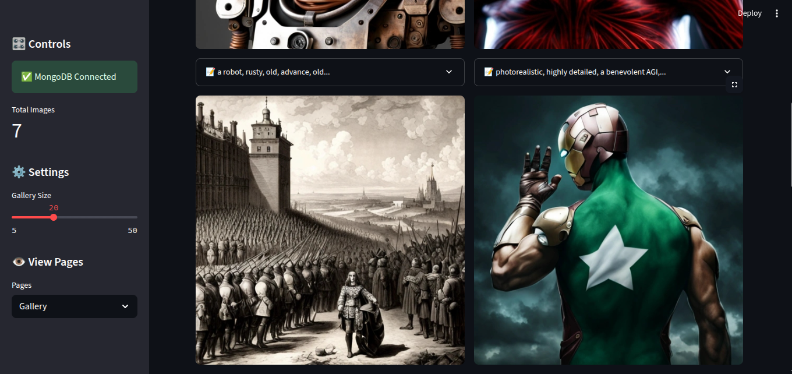

# 🖼️ Prompt-to-Image Generator with Stable Diffusion
A mini web application that generates images from text prompts using Stable Diffusion in different styles. Built with a clean and interactive Streamlit interface, it offers prompt history, an image gallery, statistics, and a feedback-based evaluation system to compare user expectations with actual results.

## 📸 Screenshots

### 🏠 Generate Image (Home Page)


### 🖼️ Gallery


### 📊 Evaluation Report


## ✨ Features
- 📝 Web Interface (Streamlit)
User-friendly UI with multiple view modes (pages).
- 📜 Prompt History Viewer
Browse your previously entered prompts.
- 🖼️ Image Gallery
View and revisit all generated images with their associated prompts.
- 📊 Statistics Panel
Track important metrics such as:

    - Average image generation time

    - Average image file size

    - Total number of generations
    - Distribution of styles Generated.

- 📈 Evaluation Report System
Users can rate how well the image matches their expectations (scale of 1–10). These ratings are analyzed to produce evaluation reports comparing prompts to image quality and alignment with intent.

## 🚀 Getting Started
### 📦 Prerequisites
- Python 3.12+

- MongoDB instance running (local or cloud)

- Hugging Face account with access token

Sure! Here’s the Installation section rewritten using uv (assuming your project uses uv for dependency management):

## 📦 Installation

### 1. Clone the repository
```bash
git clone https://github.com/Malik-Talha/text-to-image-mini-app.git
cd text-to-image-mini-app/
```

### 2. Install dependencies using uv

```bash
uv sync
```

This will create a virtual environment (if not already present) and install all dependencies declared in your pyproject.toml.

### 3. Activate the environment (if needed)

```bash
source .venv/bin/activate      # Linux/Mac
.venv\Scripts\activate         # Windows
```

### 4. Set up environment variables
Rename .env_template to .env and edit it to set required environment variables:
```ini
MONGODB_URL= <your mongodb cloud URL>
DATABASE_NAME= <database name>
COLLECTION_NAME= <generated images>

# Hugging Face API Configuration ; you can create from your hugging face account
HF_TOKEN= <hugging face token> 

# Stable Diffusion Model Configuration
PROVIDER="nebius"
MODEL="stabilityai/stable-diffusion-xl-base-1.0"

```

### 5. Run the application

```
streamlit run app.py
```
## 🤝 Contributions
PRs are welcome. Feel free to open issues or suggest enhancements.

